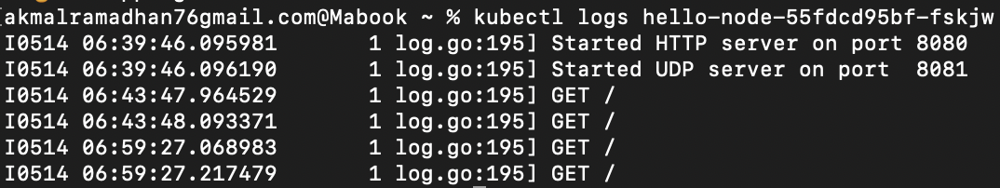

# Tutorial 11 - Advanced Programming - Deployment on Kubernetes
**Akmal Ramadhan - 2206081534 - Kelas A**

## Hello Minikube

> Compare the application logs before and after you exposed it as a Service.
Try to open the app several times while the proxy into the Service is running.
What do you see in the logs? Does the number of logs increase each time you open the app?

Terdapat perbedaan jumlah _logs_ antara sebelum melakukan _exposed_ dan sesudah melakukan _exposed_ sebagai _Service_. Sebelum di-_expose_, aplikasi diakses langsung dalam _pod_ dan _log_ mencatat pesan awal (`Started HTTP server on port 8080` dan `Started UDP server on port 8081`).

Setelah di-_expose_ sebagai _service_ menggunakan `minikube service hello-node`, log tetap mencatat pesan awal dan permintaan masuk tetapi sekarang permintaan tersebut diteruskan melalui _service_ yang memungkinkan akses eksternal kepada aplikasi. Setiap kali aplikasi diakses atau di-refresh di browser, jumlah entri log bertambah karena browser mengirimkan `GET` request ke service. Dapat dilihat pada gambar dengan waktu `06:43:46` untuk _log_ pertama dan `06:59:27` untuk _log_ kedua.

> Notice that there are two versions of `kubectl get` invocation during this tutorial section. The first does not have any option, while the latter has `-n` option with value set to
`kube-system`. What is the purpose of the `-n` option and why did the output not list the pods/services that you explicitly created? Hint: Do some reading about [Namespace in Kubernetes documentation](https://kubernetes.io/docs/concepts/overview/working-with-objects/namespaces/).

Opsi `-n` dalam perintah `kubectl get` untuk menentukan _namespace_ spesifik di Kubernetes. Opsi ini berguna ketika terdapat banyak _service_ dengan nama yang sama di berbagai _namespace_. Tanpa `-n`, perintah `kubectl get` menampilkan _resource_ dari _namespace_ _default_. _Namespace_ berfungsi untuk mengisolasi _resource_ dalam _cluster_. Dengan menggunakan `-n`, `kube-system` akan menampilkan _resource_ dari _namespace_ yang berisi komponen inti dari sistem Kubernetes, seperti DNS dan server API. Apabila kita tidak menggunakan opsi `-n`, akan ditampilkan _resource_ yang dibuat pengguna secara eksplisit.